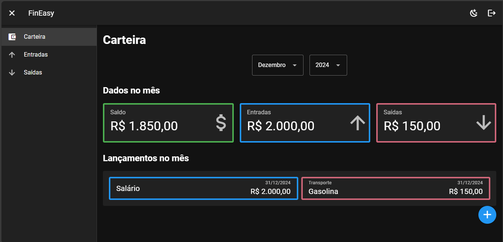

# FinEasy

Aplicação WEB para gerenciamento de finanças pessoais desenvolvida com [Vue.js](https://vuejs.org/).

Projeto desenvolvido como parte dos meus estudos em **Vue.js**, sendo este, meu primeiro contato com esta tecnologia.



## ✨ Tecnologias

- 🖼️ **Frontend**: [Vue 3](https://vuejs.org/) e [Vuetify 3](https://vuetifyjs.com/en/) para uma experiência de desenvolvimento de IU moderna e reativa
- 🗃️ **Gerenciamento de estado**: integrado ao [Pinia](https://pinia.vuejs.org/), a solução de gerenciamento de estado modular e intuitiva para Vue.
- 🚦 **Roteamento**: utiliza o [Vue Router](https://router.vuejs.org/) para navegação SPA
- 💻 **Experiência de desenvolvimento aprimorada**: beneficie-se da verificação de tipo estático do [TypeScript](https://www.typescriptlang.org/) e do conjunto de [plug-ins ESLint](https://eslint.vuejs.org/) para Vue, garantindo qualidade e consistência do código.
- ⚡ **Ferramentas de última geração**: construção de frontend com [Vite](https://vitejs.dev/), uma ferramenta extremamente rápida que impulsiona a próxima geração de aplicativos web.
- 🧩 **Importação automatizada de componentes**: Simplifique seu fluxo de trabalho com [unplugin-vue-components](unplugin-vue-components), importando componentes automaticamente conforme você os usa.
- 🛠️ **Vue fortemente tipado**: Use [vue-tsc](https://github.com/johnsoncodehk/volar/tree/master/packages/vue-tsc) para verificar o tipo de seus componentes Vue e aproveite uma experiência de desenvolvimento robusta.
- 💪 **Backend como serviço**: com o [Firebase](https://firebase.google.com/), foi fornecido o serviço de **autenticação** e **banco de dados**.

## 💿 Instalação

```sh
git clone https://github.com/diasjoaovitor/fin-easy.git
cd fin-easy
mv .env.example .env
```

Crie um projeto no [Firebase](https://firebase.google.com/), atribuas as variáveis de configuração no arquivo `.env`, habilite o `Firestore` e `Authentication`.

```sh
npm i
npm run dev
```

## 📑 License

[MIT](http://opensource.org/licenses/MIT)
